# StudyGPT

A production-grade AI study assistant that answers questions strictly from your uploaded documents. Built with a RAG (Retrieval-Augmented Generation) pipeline on AWS Bedrock, ChromaDB, Supabase, and React.

---

## What This Project Does

StudyGPT lets students upload their course PDFs and then ask natural language questions about them. The system retrieves the most relevant passages from the documents, builds a prompt with conversation history and user memory, and streams a grounded answer back word-by-word (like ChatGPT). It never makes things up — if the answer isn't in the documents, it says "I don't know."

---

## Features Built (End-to-End)

### Core RAG Pipeline
- **PDF and image ingestion** — uploads saved to disk, extracted with PyPDF / pytesseract
- **Chunking** — LangChain `RecursiveCharacterTextSplitter` (1000 chars, 150 overlap)
- **Embedding** — Amazon Titan Text Embed v2 (1024-dim vectors) via AWS Bedrock
- **Vector storage** — ChromaDB with persistent disk, cosine distance metric
- **Retrieval** — top-K semantic search with metadata filtering
- **Re-ranking** — blends cosine distance (70%) with keyword overlap (30%) for better source selection
- **LLM** — AWS Bedrock `openai.gpt-oss-120b-1:0` via `converse` / `converse_stream` API
- **Grounded answering** — system prompt instructs the model to only answer from context; returns "I don't know" otherwise

### Streaming
- **Server-Sent Events (SSE)** — `/ask/stream` endpoint streams tokens one-by-one
- **Threading + asyncio bridge** — synchronous Bedrock generator runs in a daemon thread, pushes to `asyncio.Queue` via `call_soon_threadsafe`, async SSE generator drains the queue
- **Leading `|` artifact fix** — first token has `lstrip('| \n')` applied; skipped if empty after stripping
- **Live UI updates** — React reads the SSE stream, appending each token to the message in state, giving a real-time typing effect with a blinking cursor

### Session & Memory
- **Short-term memory (in-process)** — `InMemorySessionStore` (LRU, 500 sessions max) holds up to 10 conversation turns per session; injected as `CHAT HISTORY` in every prompt
- **Session restore** — on loading an old chat, the frontend posts all past messages to `/session/restore` so the backend rebuilds in-memory context
- **Long-term memory (Supabase)** — `useMemory` hook tracks topics the student has studied across sessions; surfaced back to the LLM as `USER MEMORY` in the prompt
- **Session isolation** — each new chat gets a UUID `session_id`; server memory is wiped via `/session/clear`

### Conversation-Scoped Document Isolation
- When a PDF is uploaded, every ChromaDB chunk is tagged: `doc.metadata["session_id"] = session_id`
- At retrieval time: `where = {"session_id": session_id}` is passed to ChromaDB
- PDFs uploaded in conversation A are invisible to conversation B

### Chat Persistence (Supabase)
- **`chats` table** — one row per conversation with `title`, `session_id`, `user_id`
- **`messages` table** — every user and assistant message stored with `role`, `content`, `sources`, `feedback`
- **`user_memory` table** — per-user topic array updated after each message
- Chat list loaded on login, ordered by `created_at` descending
- Clicking a past chat restores messages and calls `/session/restore`

### Confidence Scoring
- After retrieval, the minimum cosine distance across chunks is used:
  - `< 0.25` → **High**
  - `0.25 – 0.50` → **Medium**
  - `> 0.50` → **Low**
- Shown as a color-coded badge on every assistant message

### Follow-up Questions
- After the main answer is complete, a second LLM call generates exactly 3 follow-up questions
- Prompt: strict JSON array output (`["Q1", "Q2", "Q3"]`)
- Parsed with `raw.find('[')` / `raw.rfind(']')` for robustness
- Rendered as clickable chips below the answer; clicking sends the question directly

### Document Management UI
- **Documents view** — lists all uploaded files with size (KB) and indexed status
- **Delete** — removes the file from disk and purges all its ChromaDB vectors via `delete_by_source()`
- **Page preview modal** — click a source citation chip to open a modal showing the raw text from that exact page (`/page-preview?source=&page=`)

### Feedback
- Thumbs up / thumbs down on every assistant message
- Rating written to `messages.feedback` in Supabase
- UI immediately reflects the selected state

### Export Chat
- Download button in the top bar when a conversation has messages
- Exports all messages as a `.md` file with user/assistant headings and `---` separators

### Dark Mode
- CSS variable-based theming (`[data-theme="dark"]` on `<html>`)
- Toggle in the sidebar; preference persisted in `localStorage`

### Analytics Dashboard
- Queries Supabase for the user's chats and messages
- **7-day bar chart** — messages per day (pure CSS bars, no chart library)
- **Satisfaction rate** — percentage of thumbs-up feedback out of rated messages
- **Top topics** — most frequently studied keywords extracted from `user_memory`
- **Total stats** — chats started, messages sent, feedback given

### UI / UX
- **ChatGPT-style layout** — user messages on the right, assistant on the left
- **Streaming markdown** — plain text during streaming; switches to `ReactMarkdown` once complete
- **Copy button** — appears on hover over any assistant message; copies plain text
- **Loading dots** — animated dots only shown before the first token arrives (no duplicate bubble)
- **Follow-up chips** — clickable question suggestions below each answer
- **Toast notifications** — success/error banners for upload, errors, etc.
- **Sidebar navigation** — Chat / Documents / Analytics views
- **Logout confirmation modal** — prevents accidental sign-out

---

## Tech Stack

| Layer | Technology |
|---|---|
| LLM | AWS Bedrock (`openai.gpt-oss-120b-1:0`) |
| Embeddings | Amazon Titan Text Embed v2 (`amazon.titan-embed-text-v2:0`, 1024-dim) |
| Vector store | ChromaDB (persistent, cosine distance) |
| Backend | FastAPI + Uvicorn |
| Auth + DB | Supabase (PostgreSQL + Auth) |
| Frontend | React 18 + Vite |
| PDF parsing | PyPDF + pytesseract (images) |
| Chunking | LangChain Text Splitters |
| Deployment | Render (web service + 1 GB persistent disk) |

---

## Project Structure

```
Student-chatbot/
├── app/
│   ├── api/
│   │   └── main.py              # FastAPI app — all endpoints
│   ├── rag/
│   │   ├── bedrock_llm.py       # LLM client: generate() + generate_stream()
│   │   ├── bedrock_embeddings.py
│   │   ├── chain.py             # RAGChain, ChatMemory, InMemorySessionStore
│   │   ├── retriever.py         # Retrieval + keyword re-ranking
│   │   ├── vectorstore.py       # ChromaDB wrapper (upsert, delete, list, preview)
│   │   ├── chunking.py
│   │   └── loader.py            # PDF + image → LangChain Documents
│   ├── prompts/
│   │   └── qa_prompt.py         # System instructions + user template
│   └── config.py                # Pydantic settings from .env
├── frontend/
│   ├── src/
│   │   ├── components/
│   │   │   ├── Auth.jsx         # Supabase email + OAuth login
│   │   │   ├── Sidebar.jsx      # Nav, chat list, dark mode toggle
│   │   │   ├── ChatArea.jsx     # Message list, streaming, feedback, chips
│   │   │   ├── InputZone.jsx    # Text input + file upload
│   │   │   ├── Analytics.jsx    # Stats, chart, topics
│   │   │   ├── Documents.jsx    # File list, delete, preview
│   │   │   └── ToastContainer.jsx
│   │   ├── hooks/
│   │   │   ├── useChat.js       # Streaming send, upload, Supabase persistence
│   │   │   ├── useMemory.js     # Long-term topic memory
│   │   │   └── useToast.js
│   │   ├── lib/supabase.js
│   │   ├── App.jsx              # Root: auth, view routing, dark mode, export
│   │   ├── App.css              # Layout + component styles
│   │   └── index.css            # CSS variables (light + dark themes)
│   └── vite.config.js           # Dev proxy → localhost:8000
├── requirements.txt
├── render.yaml                  # Render deployment config
└── .env.example
```

---

## Prerequisites

- Python 3.11+
- Node.js 18+
- AWS account with Bedrock access — enable both models in your region:
  - `openai.gpt-oss-120b-1:0`
  - `amazon.titan-embed-text-v2:0`
- Supabase project (free tier works)

---

## Local Setup

### 1. Clone and configure environment

```bash
git clone <repo-url>
cd Student-chatbot
cp .env.example .env
```

Edit `.env`:

```env
ENVIRONMENT=dev

# AWS Bedrock
AWS_ACCESS_KEY_ID=your_key
AWS_SECRET_ACCESS_KEY=your_secret
AWS_REGION=ap-south-1
BEDROCK_CHAT_MODEL_ID=openai.gpt-oss-120b-1:0
BEDROCK_EMBEDDING_MODEL_ID=amazon.titan-embed-text-v2:0

# Storage (auto-created)
UPLOADS_DIR=data/uploads
CHROMA_PERSIST_DIR=data/chroma
CHROMA_COLLECTION=study_docs_bedrock

# Retrieval
TOP_K=4
CHUNK_SIZE=1000
CHUNK_OVERLAP=150

CORS_ALLOW_ORIGINS=*
```

Create `frontend/.env.local`:

```env
VITE_SUPABASE_URL=https://your-project.supabase.co
VITE_SUPABASE_ANON_KEY=your_anon_key
```

### 2. Supabase schema

Run in Supabase SQL editor:

```sql
create table chats (
  id uuid primary key default gen_random_uuid(),
  user_id uuid references auth.users not null,
  title text not null,
  session_id text not null,
  created_at timestamptz default now(),
  updated_at timestamptz default now()
);

create table messages (
  id uuid primary key default gen_random_uuid(),
  chat_id uuid references chats(id) on delete cascade not null,
  role text not null check (role in ('user', 'assistant')),
  content text not null,
  sources jsonb default '[]',
  feedback smallint check (feedback in (1, -1)),
  created_at timestamptz default now()
);

create table user_memory (
  id uuid primary key default gen_random_uuid(),
  user_id uuid references auth.users not null unique,
  topics text[] default '{}',
  updated_at timestamptz default now()
);

alter table chats enable row level security;
alter table messages enable row level security;
alter table user_memory enable row level security;

create policy "Users own their chats" on chats
  for all using (auth.uid() = user_id);

create policy "Users see their messages" on messages
  for all using (
    exists (select 1 from chats where chats.id = messages.chat_id and chats.user_id = auth.uid())
  );

create policy "Users own their memory" on user_memory
  for all using (auth.uid() = user_id);
```

### 3. Start the backend

```bash
pip3 install -r requirements.txt
python3 -m uvicorn app.api.main:app --reload --port 8000
```

### 4. Start the frontend

```bash
cd frontend
npm install
npm run dev
```

Open [http://localhost:3000](http://localhost:3000).

---

## API Reference

| Method | Endpoint | Description |
|---|---|---|
| `GET` | `/healthz` | Health check; returns vector count |
| `POST` | `/upload` | Upload PDFs/images; `multipart/form-data` with optional `session_id` |
| `POST` | `/ask` | Non-streaming answer |
| `POST` | `/ask/stream` | Streaming answer via SSE |
| `POST` | `/session/restore` | Restore past messages into server-side session memory |
| `POST` | `/session/clear` | Clear session memory (used by "New chat") |
| `GET` | `/documents` | List uploaded documents with size and indexed status |
| `DELETE` | `/documents/{filename}` | Delete document from disk and remove its ChromaDB vectors |
| `GET` | `/page-preview?source=&page=` | Fetch raw text for a source file + page number |

### SSE stream events (`/ask/stream`)

```
data: {"token": "word"}
data: {"done": true, "session_id": "...", "sources": [...], "confidence": "high", "followups": ["Q1","Q2","Q3"]}
data: {"error": "message"}
```

---

## Architecture

```
Browser
  │
  ├─ POST /ask/stream
  │       │
  │       └──► FastAPI (async)
  │               │
  │               ├─ InMemorySessionStore → chat history (10 turns)
  │               ├─ ChromaDB where={"session_id": sid}
  │               │       └─ Titan Embed v2 → cosine search → top-K chunks
  │               ├─ Re-ranker (distance × 0.7 − keyword_overlap × 0.3)
  │               ├─ _build_prompt (system + user memory + history + context + question)
  │               ├─ Bedrock converse_stream → token stream
  │               │       └─ daemon thread → asyncio.Queue → SSE events → browser
  │               └─ Follow-up LLM call → JSON [Q1, Q2, Q3]
  │
  └─ Supabase
        ├─ Auth
        ├─ chats + messages
        └─ user_memory (topics[])
```

---

## Request Flow — User Query to Streamed Answer

The diagram below traces every step from the moment the user submits a question to when the final answer, sources, confidence badge, and follow-up chips appear on screen.

```mermaid
flowchart TD
    A([User types question\nin InputZone]) --> B[handleSend called\nin App.jsx]
    B --> C{Any files\nattached?}
    C -- Yes --> D[POST /upload\nwith session_id form field]
    D --> D1[Backend saves file to disk\nsanitizes filename]
    D1 --> D2[load_pdf / load_image\nextracts text per page]
    D2 --> D3[chunk_documents\n1000 chars · 150 overlap]
    D3 --> D4[Tag every chunk:\nmetadata.session_id = session_id]
    D4 --> D5[Titan Embed v2\nencodes each chunk → 1024-dim vector]
    D5 --> D6[ChromaDB upsert\nvectors stored with metadata]
    D6 --> E
    C -- No --> E[sendMessage called\nin useChat.js]

    E --> F{First message\nin this chat?}
    F -- Yes --> G[Insert new row\ninto Supabase chats table\ntitle = first 60 chars of question]
    G --> H
    F -- No --> H[Append user message\nto local React state]
    H --> H1[Insert user message\ninto Supabase messages table]
    H1 --> H2[saveTopic called →\nupdate user_memory topics array\nin Supabase]
    H2 --> I[Add empty assistant\nplaceholder to React state\nrole=assistant · text=empty]
    I --> J[POST /ask/stream\nJSON body:\nsession_id · question · user_context]

    J --> K[FastAPI /ask/stream\nreceives request]
    K --> L[Retrieve ChatMemory\nfrom InMemorySessionStore\nup to 10 past turns]
    L --> M[memory.format_for_prompt\nbuilds CHAT HISTORY string\nmax 3000 chars]
    M --> N[ChromaDB query\nwhere = session_id filter\nembeds question via Titan Embed v2]
    N --> O[Cosine similarity search\nreturn top-K chunks]
    O --> P[Re-ranker\nscore = distance × 0.7\n− keyword_overlap × 0.3\nsort ascending]
    P --> Q{Any chunks\nretrieved?}

    Q -- No --> R[Yield IDK token\nYield AnswerResult sources=empty\nconfidence=low]
    R --> S[SSE: done event sent\nfollowups=empty]

    Q -- Yes --> T[_build_prompt assembles:\n1 · QA_SYSTEM_INSTRUCTIONS\n2 · USER MEMORY topics\n3 · CHAT HISTORY\n4 · Retrieved context passages\n5 · User question]
    T --> U[Bedrock converse_stream\ncalled with full prompt]
    U --> V[Daemon thread starts\niterates converse_stream events]
    V --> V1{First token?}
    V1 -- Yes --> V2[lstrip pipe/space/newline\nSkip if empty after strip]
    V2 --> V3
    V1 -- No --> V3[loop.call_soon_threadsafe\npush token onto asyncio.Queue]
    V3 --> V4{More tokens?}
    V4 -- Yes --> V1
    V4 -- No --> V5[Push None sentinel\nonto Queue]

    V3 --> W[async event_stream\ndrains Queue item by item]
    W --> X[Yield SSE event:\ndata: token string]
    X --> Y[Browser ReadableStream\ndecodes SSE line]
    Y --> Z[Parse data.token\nappend to fullText string]
    Z --> AA[setMessages updates\nlast message text = fullText\nblinking cursor visible]
    AA --> AB{Stream\nfinished?}
    AB -- No --> Y

    V5 --> AC[_normalize_answer\ncleans raw joined text]
    AC --> AD[_calc_confidence\nbest cosine distance → high/medium/low]
    AD --> AE[_unique_sources\ndeduplicate citation strings]
    AE --> AF[memory.add_turn\nstore q+answer in session memory]
    AF --> AG{answer != IDK?}
    AG -- Yes --> AH[_generate_followups\nsecond LLM call\nJSON array prompt]
    AH --> AI[Parse JSON array\nraw.find bracket · raw.rfind bracket\nreturn 3 strings]
    AI --> AJ
    AG -- No --> AJ[Push AnswerResult\nonto Queue:\nanswer · sources · confidence · followups]

    AJ --> AK[event_stream yields\nSSE done event:\ndone=true · session_id · sources\nconfidence · followups]
    AK --> AB

    AB -- Yes stream done --> AL[Frontend receives done event]
    AL --> AM[setMessages updates last message:\nconfidence badge · followups chips\nsource citation chips]
    AM --> AN[Save completed assistant message\nto Supabase messages table\ncapture returned message id]
    AN --> AO[Update message in state\nwith Supabase message id\nneeded for feedback]
    AO --> AP[Update chats.updated_at\nin Supabase]

    AP --> AQ([User sees:\nFull streamed answer · Markdown rendered\nConfidence badge · Source chips\nFollow-up question chips\nCopy button · Thumbs feedback])

    AQ --> AR{User clicks\nfollow-up chip?}
    AR -- Yes --> E
    AR -- Thumbs up/down --> AS[submitFeedback\nPATCH messages.feedback\nin Supabase]
    AR -- Source chip click --> AT[Open page preview modal\nGET /page-preview?source=&page=\nShow raw passage text]
    AR -- Export button --> AU[exportChat\nGenerate markdown string\nDownload as .md file]

    style A fill:#4f46e5,color:#fff
    style AQ fill:#16a34a,color:#fff
    style R fill:#dc2626,color:#fff
    style Q fill:#d97706,color:#fff
    style C fill:#d97706,color:#fff
    style F fill:#d97706,color:#fff
    style V1 fill:#d97706,color:#fff
    style AG fill:#d97706,color:#fff
    style AB fill:#d97706,color:#fff
    style AR fill:#d97706,color:#fff
```



---

## Key Design Decisions and Bug Fixes

### SPA catch-all must be registered last
FastAPI matches routes in registration order. The wildcard `/{full_path:path}` must be added at the very end of `create_app()`, otherwise it intercepts all API routes including `/documents`.

### FastAPI 204 responses must not have a body
Using `status_code=204` in the decorator while returning a value raises an `AssertionError`. The fix is `return Response(status_code=204)` without a body.

### Streaming uses a thread+queue bridge
AWS Bedrock's `converse_stream` is synchronous. FastAPI's SSE needs an async generator. The solution: run the synchronous iterator in a daemon thread, push items to `asyncio.Queue` via `loop.call_soon_threadsafe`, and drain the queue in an async generator.

### Loading indicator must not show during streaming
Showing loading dots while `loading=True` caused a duplicate assistant bubble. The fix: only show loading dots when `loading && messages[messages.length - 1]?.role !== 'assistant'`. Once the first SSE token arrives and an assistant message is added, the dots disappear.

### Leading pipe character in model output
The model occasionally outputs `|` as the very first character. Fixed by calling `token.lstrip('| \n')` on the first token only, and skipping the yield if the result is empty.

---

## Deployment on Render

`render.yaml` is included for one-click deployment.

1. Push to GitHub.
2. Create a new Render **Web Service** linked to the repo.
3. Render reads `render.yaml` automatically.
4. Add secret env vars in the Render dashboard:
   - `AWS_ACCESS_KEY_ID`
   - `AWS_SECRET_ACCESS_KEY`
   - `VITE_SUPABASE_URL`
   - `VITE_SUPABASE_ANON_KEY`
5. A 1 GB persistent disk at `/data` stores ChromaDB vectors and uploaded files across deploys.

Build command: `pip install -r requirements.txt && cd frontend && npm install && npm run build`

Start command: `uvicorn app.api.main:app --host 0.0.0.0 --port $PORT`

The React build output goes into `app/static/`, which FastAPI serves as a single-page application from the same origin — no separate frontend hosting needed.

---

## License

MIT
